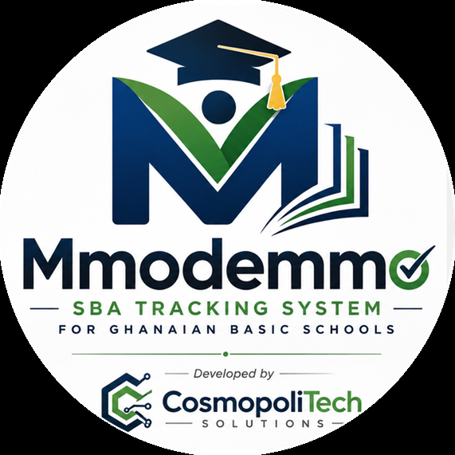
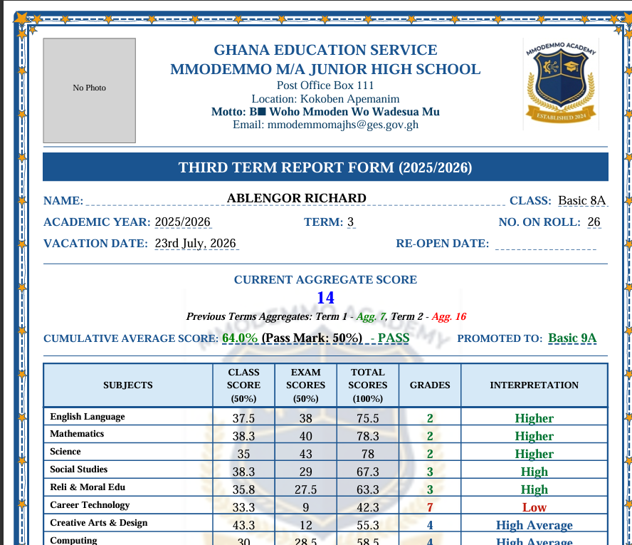
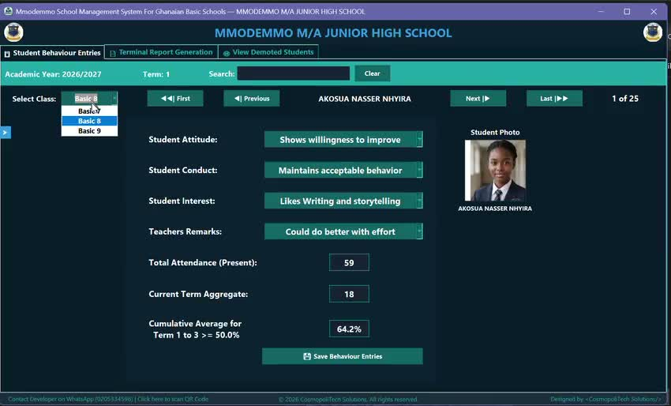
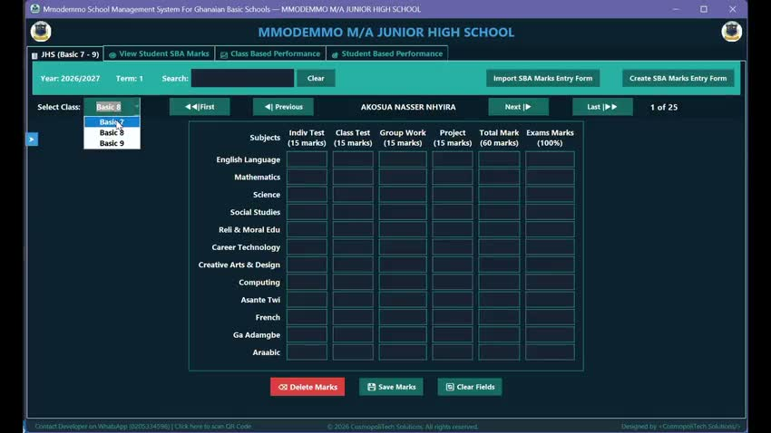
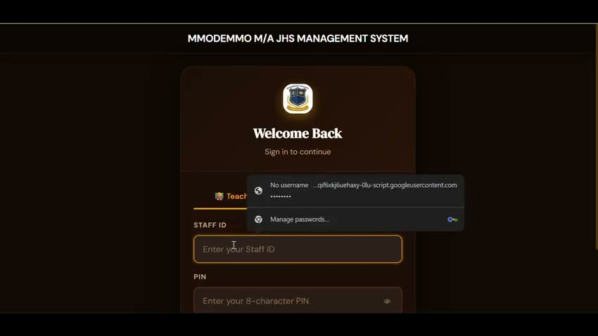

# Mmodemmo School Management System — Website

Marketing and legal pages for **Mmodemmo School Management System**, a one-time-purchase
Windows desktop application (with a companion online portal) built for Ghanaian basic
schools — covering attendance, levy collection, SBA/exam marks, and report cards.

Live site: https://cosmopolitechdev-tech.github.io/mmodemmo-sma-portal/

## Features covered on the site

- **SBA & Mock Exam Marks** — record and manage School-Based Assessment and mock exam scores
- **Automatic Report Card Generation** — instant report cards from recorded marks
- **Attendance & Levies** — daily attendance and levy/fee collection tracking
- **SMS Notifications** — automated SMS alerts to parents/guardians
- **BECE Results Analysis** — analysis of BECE outcomes
- **Automatic Backup** — scheduled backups of school data
- **Online Teacher Portal** — a companion web portal with PIN-based teacher access, alongside the desktop app

Pricing is one-time purchase, with no subscription and no built-in expiry — see `sales.html`
for current tiers (Desktop Only vs. Desktop + Online Portal).

## Screenshot

## Walkthroughs

Click a thumbnail to open the video clip.

## Pages

| File | Purpose |
|---|---|
| `index.html` | Homepage |
| `sales.html` | Features & pricing |
| `privacy.html` | Privacy policy |
| `terms.html` | Terms & conditions |
| `images/` | Logo, screenshots, and short feature-preview clips |

## Contact

cosmopolitech.dev@gmail.com
